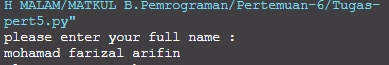

# Bahasa Pemrograman Tugas Pertemuan-6

Repository ini digunakan untuk memenuhi Tugas Bahasa Pemrograman Pertemuan-6<br><br>
Nama : Mohamad Farizal Arifin <br>
NIM : 312010231<br>
Kelas : TI.20.B.1<br>

### DAFTAR ISI <br>
| No | Description | Link |
| ----- | ----- | ---- |
| 1 | Tugas Pertemuan-5 | [Click Here](#pertemuan-5---tugas) |
| 2 | Pertemuan-6 - Lab 1 | [Click Here](#pertemuan-6---lab-1) |
| 3 | Pertemuan-6 - Lab 1-1 | [Click Here](#pertemuan-6---lab-1-1) |
| 4 | Pertemuan-6 - Lab 2 | [Click Here](#pertemuan-6---lab-2)

## Tugas Pertemuan-5

Sebelumnya pada pertemuan-5 Bahasa Pemrograman, ada tugas yang diberikan oleh Dosen untuk membuat Aplikasi Biodata dengan Python (Seperti Gambar dibawah ini):
<br>
* Berikut *source code* atau klik link berikut ( [Tugas 5 Python](Tugas-pert5.py) ): <br>
```python
print("please enter your full name : ")
fullname=input()
print("please enter nickname : ")
nickname=input()
print("pleas enter your NPM : ")
npm=int(input())
print("please enter your place of birth : ")
pob=input()
print("please enter your date of birth : ")
date=int(input())
print("please enter your month of birth : ")
month=input()
print("please enter year of birth : ")
year=int(input())
print("please enter your phone number : ")
phone=int(input())
print("please enter your address : ")
address=input()

dob=2020-year

print("\n\n Hello.. ")
print(f"Let me introduce my self. My name is {fullname}, but you can call me {nickname}. My NPM {npm}. I was born in {pob} and iam {dob} years old. I am very glad if you want to invite my house in {address}. So don't forget to call me before with the number {phone}. \n\n Thank You... ")
```
* Berikut hasil dari source code diatas :<br>


Keterangan : <br>
1.Variabel adalah sebuah wadah penyimpanan data pada program yang akan digunakan selama program itu berjalan. Yang berfungsi sebagai variable dalam source code diatas adalah **fullname** . <br>
 ``` python
print("Nama Saya adalah ...")
print(1234567)
```
<br>(Seperti gambar dibawah ini)<br>
 <br>
2. Fungsi **input()** adalah untuk memasukkan nilai dari layar console di command prompt, lalu kemudian mengembalikan nilai saat kita menekan tombol enter *(newline)*<br>
``` python
fullname=input()
```
<br>
Gambar diatas adalah hasil dari inputan tersebut<br><br>
* Untuk memasukkan perintah lain seperti *Nickname, NPM, Place Of Birth, Date of Birth, Year of Birth, Phone Number, and Address* mengikuti perintah yang sama seperti memasukkan *fullname*<br>

* Untuk menghitung rumus umur saya menggunakan variable *DOB* yaitu 2020 (Tahun Sekarang) dikurangi dengan Year of Birth, pada source code berikut :<br>
``` python
dob=2020-year
```
<br> Pada syntax/source code diatas, saya menggunakan variable *dob* dimana untuk menghitung umur (variable **age** pada output), yaitu degan rumus pada variable *dob=2020-year*
<br>
3. Fungsi **\n** pada source code diatas adalah untuk memberi baris baru / enter / *(newline)*<br>
4. Fungsi print() seperti dijelaskan pada poin **Outout** adalah untuk menampilkan Hasil dari source code seperti diatas<br>
5. Fungsi huruf **f** pada perintah *print(f"...")* adalah fungsi print atau bisa memudahkan programmer dalam mencetak statement dalam satu baris dibandingkan dengan metode yang lama yaitu memisahkan string dan variable dengan simbol koma ( , ) atau plus ( + )<br>
6. Sedangkan fungsi {} pada output tersebut adalah untuk menampilkan hasil dari variable<br>

## Pertemuan-6 Lab 1

Pada halaman ini (Tugas Pertemuan-6 Lab 1) Dosen memberi tugas yaitu mempelajari Operator Aritmatika menggunakan Bahasa Pemrograman Python. Berikut source code yang diberikan oleh Dosen [Source Code Lab 1](Lab1.py) :
<br>
``` python
#Penggunaan End
print("A", end="")
print("B", end="")
print("C", end="")

print()
print("X")
print("Y")
print("Z")

#Penggunaan Separator
w,x,y,z=10,15,20,25
print(w,x,y,z)
print(w,x,y,z,sep=",")
print(w,x,y,z,sep="")
print(w,x,y,z,sep=":")
print(w,x,y,z,sep="-----")
```
Berikut penjelasan tentang materi yang diberikan oleh Dosen<br><br>

* Penggunaan END
 Penggunaan end digunakan untuk menambahkan karakter yang dicetak di akhir baris.
 Secara default penggunaan end adalah untuk ganti baris.
``` python
print("A", end="")
print("B", end="")
print("C", end="")
```
> Penggunaan print() digunakan untuk mencetak output, seperti syntax dibawah ini :
``` python 
print()
```

> Syntax dibawah ini digunakan untuk menampilkan output berupa string
``` python
print("X")
print("Y")
print("Z")
```
Berikut hasil dari source code tersebut :<br>
<br>

* Penggunaan Separator
Separator adalah pemisah yang berfungsi sebagai tanda pemisah antar objek yang dicetak. Defaultnya adalah tanda spasi.<br><br>
 
> Pendeklarasian beberapa variable beserta nilainya
``` python
w,x,y,z=10,15,20,25
```
> Menampilkan hasil dari variable tiap-tiap variable
``` python
print(w,x,y,z)
```
> Menampilkan hasil dari tiap-tiap variable dengan menggunakan pemisah , (koma)
``` python
print(w,x,y,z,sep=",")
```
> Menampilkan hasil dari tiap-tiap variable tanpa menggunakan pemisah
``` python
print(w,x,y,z,sep="")
```
> Menampilkan hasil dari tiap-tiap variable dengan menggunakan pemisah : (titik dua)
``` python
print(w,x,y,z,sep=":")
```
> Menampilkan hasil dari tiap-tiap variable dengan menggunakan pemisah -----
``` python
print(w,x,y,z,sep="-----")
```
Hasil dari syntax diatas adalah seperti berikut : <br>

<br>
<br>

## Pertemuan-6 Lab 1-1

